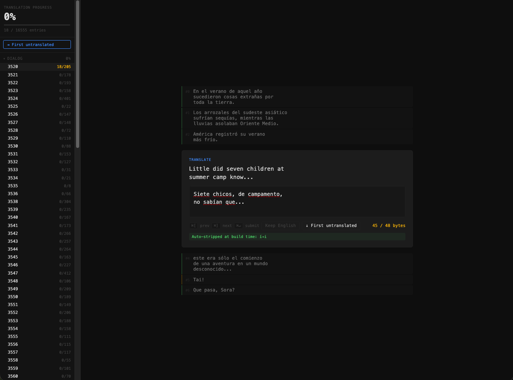

# Digimon Adventure PSP — Translation Toolkit

> Translate **Digimon Adventure (PSP)** into any language, starting from the [English fan patch (v1.2)](https://digimonadventurenglish.weebly.com).

[](docs/screenshot.png)

The toolkit extracts all dialog and UI text from the English patch, exposes it through a keyboard-driven web UI for translators, and repackages the finished work into a playable ISO and a distributable xdelta patch.

---

## Features

- **Web-based translation UI** — monospace editor with context lines, byte counter, and live linter. Keyboard-first: `Cmd/Ctrl+Enter` to submit, `[` / `]` to navigate.
- **Live linter** — flags accented characters that will be auto-stripped at build time, warns on lines that overflow the dialog box, and blocks submission if the byte limit is exceeded.
- **Progress tracking** — per-file and overall percentage, always visible in the sidebar.
- **One-command build** — `apply` patches the CPK in-place and produces a full ISO + xdelta patch.
- **Language-agnostic** — the source text is the English patch; any target language plugs straight in.

---

## What you need

Two ISOs placed in the **root of this repository**, with these exact filenames:

| File | Description |
|------|-------------|
| `3161 - Digimon Adventure (Japan).iso` | Original Japanese dump (No-Intro name) |
| `3161 - Digimon Adventure (Japan) - English Patch 1.2.iso` | Japanese ISO with the English fan patch v1.2 applied |

To create the English-patched ISO from the Japanese one and the fan patch xdelta:

```bash
xdelta3 -d -s "3161 - Digimon Adventure (Japan).iso" \
    "Digimon Adventure (English Patch Ver. 1.2).xdelta" \
    "3161 - Digimon Adventure (Japan) - English Patch 1.2.iso"
```

> Both ISO files are gitignored and will never be committed to this repository.

---

## Setup

**1. Clone and enter the repo**

```bash
git clone https://github.com/zlotny/digimon-adventure-psp-translation-kit
cd digimon-adventure-psp-translation-kit
```

**2. Create a virtual environment and install dependencies**

```bash
python3 -m venv .venv
source .venv/bin/activate      # Windows: .venv\Scripts\activate
pip install -r requirements.txt
```

**3. Install Node.js 18+** (needed for the translation web UI)

Download from [nodejs.org](https://nodejs.org/) or `brew install node` on macOS.

**4. Install xdelta3** (needed to generate distributable patches)

```bash
# macOS
brew install xdelta

# Debian / Ubuntu
sudo apt install xdelta3

# Windows — download from https://github.com/jmacd/xdelta-gpl/releases
```

**5. Extract the game files**

The ISOs must be unpacked into `orig_iso/` and `patched_iso/` before the toolkit can read them. Use [7-Zip](https://www.7-zip.org/) (cross-platform) or `hdiutil` on macOS:

```bash
# Using 7z (all platforms)
7z x "3161 - Digimon Adventure (Japan).iso" -o orig_iso/
7z x "3161 - Digimon Adventure (Japan) - English Patch 1.2.iso" -o patched_iso/

# macOS alternative (no extra install)
mkdir -p orig_iso patched_iso
hdiutil attach -mountpoint orig_iso "3161 - Digimon Adventure (Japan).iso"
hdiutil attach -mountpoint patched_iso "3161 - Digimon Adventure (Japan) - English Patch 1.2.iso"
```

**6. Run the full extraction**

```bash
python digimon_toolkit/cli.py extract-all
```

This creates `orig_data/`, `patched_data/`, and the `translations/` working tree. It takes a couple of minutes.

---

## Translation workflow

### Web UI (recommended)

```bash
python digimon_toolkit/cli.py serve
```

Opens a browser at `http://localhost:5174`. On the first run it installs the Node.js dependencies and builds the app automatically.

The sidebar shows every file with its done/total count. Click a file — or press **⇥ First untranslated** — to jump straight to work.

| Key | Action |
|-----|--------|
| `Enter` | Line break in the translation |
| `Cmd/Ctrl+Enter` | Save entry and advance |
| `Cmd/Ctrl+[` | Go to previous entry |
| `Cmd/Ctrl+]` | Go to next entry (discard changes) |

The linter runs on every keystroke and blocks submission when:
- The translation exceeds the byte limit for that entry
- More than 3 lines are present (dialog box overflow)
- A literal `\n` is typed instead of pressing Enter
- Unsupported characters are found

Accented characters (á, é, ñ…) are highlighted but allowed — they are stripped to their ASCII equivalents automatically at build time.

When a file is finished the UI advances to the next one automatically.

### CSV workflow (advanced / bulk editing)

```bash
python digimon_toolkit/cli.py to-csv      # export JSONs → CSVs in translations/csv/
# edit translations/csv/dialog/*.csv in any spreadsheet or editor
python digimon_toolkit/cli.py from-csv    # import back to JSON
python digimon_toolkit/cli.py apply       # build ISO + patch
```

### Building the output

```bash
python digimon_toolkit/cli.py apply
```

Output files land in `output/`:

| File | Description |
|------|-------------|
| `Digimon Adventure (Translated).iso` | Full ISO — load in PPSSPP to test |
| `translation_patch.xdelta` | Distributable patch (applied over the Japanese ISO) |

---

## CLI reference

```bash
python digimon_toolkit/cli.py extract-cpk              # Extract orig_data/ and patched_data/
python digimon_toolkit/cli.py extract-text             # Parse ESDF text → JSON in translations/
python digimon_toolkit/cli.py extract-images           # Extract patched UI textures to output/images/
python digimon_toolkit/cli.py extract-image <id>       # Extract images from a single file (e.g. 0156)
python digimon_toolkit/cli.py inject-image <id> <N> <png>  # Replace image N in file <id>
python digimon_toolkit/cli.py extract-all              # Run all three extract steps
python digimon_toolkit/cli.py to-csv                   # Export JSON → CSV (translations/csv/)
python digimon_toolkit/cli.py from-csv                 # Import CSV → JSON
python digimon_toolkit/cli.py progress                 # Show translation progress
python digimon_toolkit/cli.py apply                    # Build ISO + xdelta patch
python digimon_toolkit/cli.py serve                    # Launch translation web UI
```

---

## Credits

- **[English fan patch v1.2](https://digimonadventurenglish.weebly.com)** — the team who translated the game into English, providing the source text for this toolkit.
- **CriPakTools** by [esperknight](https://github.com/esperknight/CriPakTools) (originally by Falo and Nanashi3) — the reference implementation for CRI CPK archive parsing that informed `cpk.py` and `utf.py`.
- **LibPSPThemes** — swizzle algorithm reference used in `psp_image.py`.

---

## License

MIT — see [LICENSE](LICENSE).
